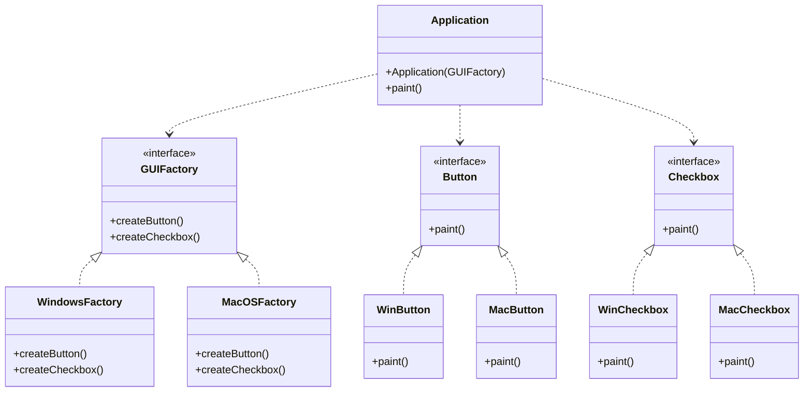

# Abstract Factory Pattern

Below is a class diagram for an abstract factory example.

### Explanation
- `Button` and `Checkbox` define the product interfaces.
- `GUIFactory` defines methods for creating related products.
- `WindowsFactory` and `MacOSFactory` create product families for a specific platform.
- `Application` uses the abstract factory to get compatible UI components.
- The client can switch product families without changing application code.
