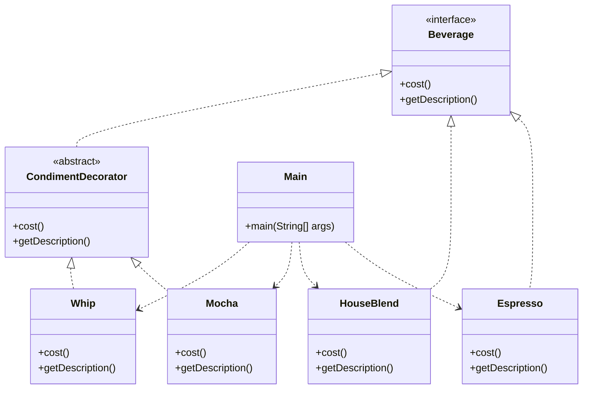

# Decorator Pattern

Below is a class diagram for the decorator example implemented in the Java code.

### Explanation
- `Beverage` defines the interface for objects that can have responsibilities added.
- `Espresso` and `HouseBlend` are concrete beverages.
- `CondimentDecorator` is an abstract decorator that also implements `Beverage`.
- `Mocha` and `Whip` add behavior to a `Beverage` object at runtime.
- `Main` builds a decorated beverage and demonstrates the pattern.
