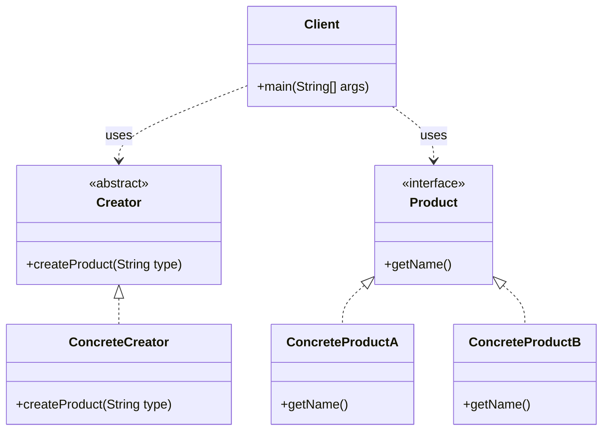

# Factory Pattern

Below is a class diagram for a simple factory method example.

### Explanation
- `Product` defines the interface for objects created by the factory.
- `ConcreteProductA` and `ConcreteProductB` are different implementations.
- `Creator` declares the factory method.
- `ConcreteCreator` implements the factory method and decides which product to create.
- `Client` calls the factory method instead of instantiating products directly.
