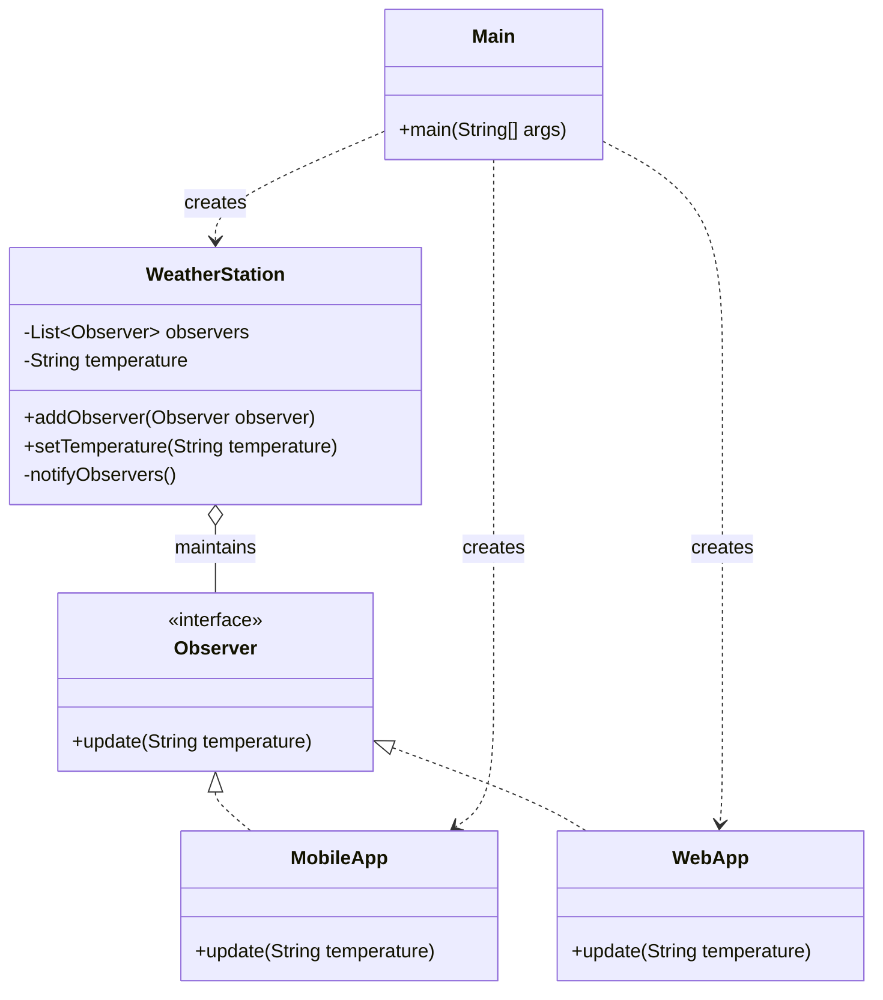

# Observer Design Pattern

Below is a class diagram for the observer example implemented in the Java code.

### Explanation
- `WeatherStation` acts as the subject.
- `Observer` is the interface implemented by all subscribers.
- `MobileApp` and `WebApp` are concrete observers.
- `Main` wires everything together and demonstrates the pattern.
