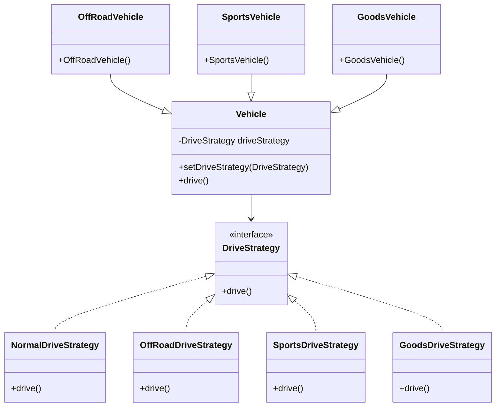

# Strategy Pattern

## Class Diagram

```mermaid
classDiagram
    class DriveStrategy {
        <<interface>>
        +drive()
    }

    class NormalDriveStrategy {
        +drive()
    }

    class OffRoadDriveStrategy {
        +drive()
    }

    class SportsDriveStrategy {
        +drive()
    }

    class GoodsDriveStrategy {
        +drive()
    }

    class Vehicle {
        -DriveStrategy driveStrategy
        +setDriveStrategy(DriveStrategy)
        +drive()
    }

    class OffRoadVehicle {
        +OffRoadVehicle()
    }

    class SportsVehicle {
        +SportsVehicle()
    }

    class GoodsVehicle {
        +GoodsVehicle()
    }

    DriveStrategy <|.. NormalDriveStrategy
    DriveStrategy <|.. OffRoadDriveStrategy
    DriveStrategy <|.. SportsDriveStrategy
    DriveStrategy <|.. GoodsDriveStrategy
    Vehicle --> DriveStrategy
    OffRoadVehicle --|> Vehicle
    SportsVehicle --|> Vehicle
    GoodsVehicle --|> Vehicle
```

## Summary

The vehicle depends on a strategy object instead of hardcoding its behavior.
This avoids duplicate code and makes the behavior easy to change.
